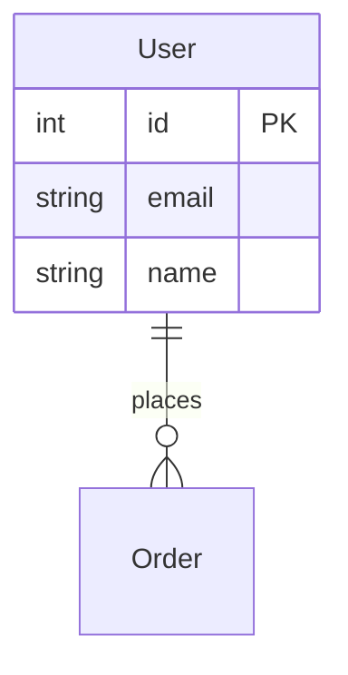

# PRD Generator Skill

> Claude Code Skill - 从代码库自动生成产品需求文档 (PRD)

[](https://github.com/anthropics/claude-code)
[](https://www.python.org/)

## ✨ 功能特性

| 功能 | 描述 |
|------|------|
| 📄 **PRD生成** | 自动分析代码库，生成完整的产品需求文档 |
| 🗺️ **ER图生成** | 从数据模型生成实体关系图 (Mermaid/DBML) |
| 🔌 **API导出** | 导出Postman/Insomnia/OpenAPI集合 |
| 🔄 **用户流程图** | 分析页面路由生成用户流程图 |
| 🔍 **代码质量分析** | 检测TODO/FIXME、安全漏洞、代码异味 |
| 🗃️ **Schema生成** | 生成SQL/Prisma数据库Schema |
| 📷 **截图捕获** | Playwright自动截取应用页面 |
| 📝 **Word转换** | Markdown转Word文档 |

## 🚀 快速安装

### 方法1: Git Clone

```bash
# 克隆到Claude Code的skills目录
git clone https://github.com/YOUR_USERNAME/prd-generator-skill.git ~/.claude/skills/prd-generator
```

### 方法2: 手动安装

1. 下载此仓库
2. 复制到 `~/.claude/skills/prd-generator/`

### 安装依赖（可选）

```bash
# 截图功能
pip install playwright
playwright install chromium

# Word输出
pip install python-docx
```

## 📖 使用方法

### 在 Claude Code 中使用

```
# 基本用法
"帮我生成这个项目的PRD文档"

# GitHub仓库
"为 https://github.com/owner/repo 生成PRD"

# 指定选项
"为我的项目生成PRD，关注技术架构，输出Word格式"
```

### 命令行直接调用

```bash
# 代码分析
python scripts/analyze_codebase.py /path/to/project

# 生成ER图
python scripts/generate_er_diagram.py /path/to/project --format mermaid

# 导出API集合
python scripts/export_api_collection.py /path/to/project --format postman

# 代码质量分析
python scripts/analyze_todos.py /path/to/project

# 生成数据库Schema
python scripts/generate_schema.py /path/to/project --format prisma
```

## 📁 项目结构

```
prd-generator/
├── SKILL.md                    # Skill定义文件
├── README.md                   # 本文件
├── 使用说明.md                  # 详细使用指南
├── scripts/
│   ├── analyze_codebase.py     # 深度代码分析
│   ├── generate_er_diagram.py  # ER图生成
│   ├── export_api_collection.py # API集合导出
│   ├── generate_user_flow.py   # 用户流程图
│   ├── analyze_todos.py        # TODO/质量分析
│   ├── generate_schema.py      # Schema生成
│   ├── capture_screenshots.py  # 截图捕获
│   └── convert_to_docx.py      # Word转换
└── references/
    └── prd_template.md         # PRD模板
```

## 🛠️ 支持的项目类型

| 类型 | 框架 |
|------|------|
| **前端** | React, Vue, Angular, Svelte, Next.js, Nuxt |
| **后端** | Node.js, Python (FastAPI/Django/Flask), Go, Java |
| **全栈** | Next.js, Nuxt, SvelteKit |
| **数据库** | SQL, Prisma, SQLAlchemy, Pydantic |

## 📊 输出示例

### PRD文档结构

- 执行摘要
- 产品概述
- 用户画像
- 功能需求 (前端/后端/API)
- 技术架构
- 数据模型
- API文档
- 测试策略
- 部署指南
- 未来路线图

### ER图 (Mermaid)



## 🔧 配置选项

| 选项 | 说明 |
|------|------|
| 关注领域 | 技术架构 / 用户功能 / 业务需求 |
| 目标读者 | 开发者 / 产品经理 / 投资者 |
| 详细程度 | 快速概览 / 标准 / 深度分析 |
| 输出格式 | Markdown / Word / 两者 |
| 语言 | 中文 / English |

## 📝 更新日志

### v2.0 (2026-03-29)
- ✨ 新增ER图生成
- ✨ 新增API集合导出
- ✨ 新增用户流程图
- ✨ 新增代码质量分析
- ✨ 新增Schema生成
- ✨ 新增交互式配置

### v1.0 (2026-03-26)
- 🎉 初始版本

## 🤝 贡献

欢迎提交 Issue 和 Pull Request！

## 📄 License

MIT License

---

**Made with ❤️ for Claude Code**
