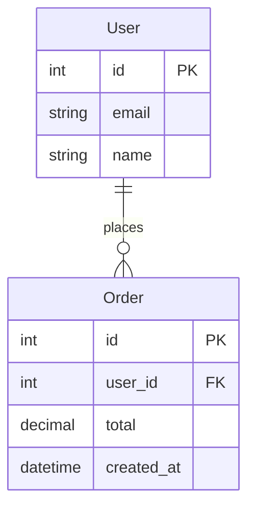

# PRD Generator Skill 使用说明

> 版本: 2.0
> 更新日期: 2026-03-29

---

## 快速开始

### 1. 基本用法

```
# 在 Claude Code 中直接说：
"帮我生成这个项目的PRD文档"
"为 https://github.com/owner/repo 生成PRD"
```

### 2. 安装依赖（可选）

```bash
# 截图功能需要
pip install playwright
playwright install chromium

# Word输出需要
pip install python-docx
```

---

## 功能一览

| 功能 | 命令/触发词 | 输出 |
|------|------------|------|
| **PRD生成** | "生成PRD" | PRD.md / PRD.docx |
| **ER图生成** | "生成ER图" | Mermaid / DBML |
| **API集合导出** | "导出API集合" | Postman / Insomnia / OpenAPI |
| **用户流程图** | "生成用户流程图" | Mermaid / PlantUML |
| **代码质量分析** | "分析代码质量" | Markdown报告 |
| **数据库Schema** | "生成数据库Schema" | SQL / Prisma |

---

## 使用场景

### 场景1: 本地项目生成PRD

```
用户: 帮我生成 ~/projects/my-app 的PRD文档

Claude: 我需要了解一些信息：
1. 关注重点：技术架构 / 用户功能 / 业务需求？
2. 目标读者：开发者 / 产品经理 / 投资者？
3. 详细程度：快速概览 / 标准 / 深度分析？
4. 是否需要截图？
5. 输出格式：Markdown / Word / 两者？

用户: 技术架构，给开发者看，深度分析，不需要截图，Markdown

Claude: [开始分析并生成PRD]
```

### 场景2: GitHub仓库生成PRD

```
用户: 为 https://github.com/owner/repo 生成PRD

Claude: [使用zread MCP或git clone获取代码]
        [分析并生成PRD]
```

### 场景3: 生成ER图

```
用户: 帮我分析项目的数据模型并生成ER图

Claude: [运行 generate_er_diagram.py]
        [输出Mermaid格式的ER图]
```

### 场景4: 导出API到Postman

```
用户: 把项目的API导出为Postman集合

Claude: [运行 export_api_collection.py]
        [生成 postman_collection.json]
```

---

## 脚本直接调用

### analyze_codebase.py - 代码分析

```bash
# 标准分析
python scripts/analyze_codebase.py /path/to/project

# 深度分析
python scripts/analyze_codebase.py /path/to/project --deep

# 输出到文件
python scripts/analyze_codebase.py /path/to/project --output analysis.json
```

**输出内容：**
- 项目类型检测 (Next.js, Django, FastAPI等)
- 技术栈识别
- API端点列表
- 数据模型列表
- 组件列表
- 依赖关系图

---

### generate_er_diagram.py - ER图生成

```bash
# Mermaid格式
python scripts/generate_er_diagram.py /path/to/project --format mermaid

# DBML格式 (dbdiagram.io)
python scripts/generate_er_diagram.py /path/to/project --format dbml -o er.dbml
```

**支持的源：**
- TypeScript interfaces
- Python dataclasses / Pydantic
- SQL CREATE TABLE
- Prisma schema

---

### export_api_collection.py - API集合导出

```bash
# Postman格式
python scripts/export_api_collection.py /path/to/project --format postman

# Insomnia格式
python scripts/export_api_collection.py /path/to/project --format insomnia

# OpenAPI格式
python scripts/export_api_collection.py /path/to/project --format openapi

# 指定基础URL
python scripts/export_api_collection.py /path/to/project --format postman --base-url https://api.example.com
```

**支持的框架：**
- Next.js API Routes
- Express.js
- FastAPI
- Flask
- Go HTTP handlers

---

### generate_user_flow.py - 用户流程图

```bash
# Mermaid格式
python scripts/generate_user_flow.py /path/to/project --format mermaid

# PlantUML格式
python scripts/generate_user_flow.py /path/to/project --format plantuml

# JSON格式
python scripts/generate_user_flow.py /path/to/project --format json
```

**检测内容：**
- 页面路由
- 导航链接
- 表单提交
- API调用
- 条件渲染

---

### analyze_todos.py - TODO/代码质量分析

```bash
# Markdown报告
python scripts/analyze_todos.py /path/to/project --format markdown

# JSON报告
python scripts/analyze_todos.py /path/to/project --format json

# 只显示高优先级问题
python scripts/analyze_todos.py /path/to/project --severity high
```

**检测内容：**
- TODO/FIXME注释
- 安全漏洞 (eval, XSS, 硬编码密钥)
- 性能问题
- 代码异味

---

### generate_schema.py - 数据库Schema生成

```bash
# 生成SQL (PostgreSQL)
python scripts/generate_schema.py /path/to/project --format sql --dialect postgresql

# 生成SQL (MySQL)
python scripts/generate_schema.py /path/to/project --format sql --dialect mysql

# 生成Prisma Schema
python scripts/generate_schema.py /path/to/project --format prisma
```

---

### capture_screenshots.py - 截图捕获

```bash
# 基本用法
python scripts/capture_screenshots.py --url http://localhost:3000 --output ./screenshots

# 指定路由
python scripts/capture_screenshots.py --url http://localhost:3000 --routes / /about /contact

# 自定义视口
python scripts/capture_screenshots.py --url http://localhost:3000 --width 1920 --height 1080
```

---

### convert_to_docx.py - Markdown转Word

```bash
# 基本转换
python scripts/convert_to_docx.py PRD.md

# 指定输出路径
python scripts/convert_to_docx.py PRD.md -o output/PRD.docx
```

---

## 输出示例

### PRD文档结构

```markdown
# 项目名称 - 产品需求文档

## 1. 执行摘要
## 2. 产品概述
## 3. 用户画像
## 4. 功能需求
   4.1 前端功能
   4.2 后端功能
   4.3 API端点
## 5. 技术架构
   5.1 技术栈
   5.2 系统架构图
   5.3 API文档
   5.4 数据模型
## 6. 非功能需求
## 7. UI/UX文档
## 8. 测试策略
## 9. 部署指南
## 10. 未来路线图
## 11. 附录
```

### ER图示例 (Mermaid)



### 用户流程图示例 (Mermaid)

```mermaid
flowchart TD
    page_Home[Home Page]
    page_Home -->|Navigate| page_Products[Products]
    page_Products -->|Submit Form| api_search[/api/search]
    api_search -->|Redirect| page_Results[Results]
```

---

## 常见问题

### Q: 截图功能不工作？
```bash
# 安装Playwright和浏览器
pip install playwright
playwright install chromium
```

### Q: Word输出失败？
```bash
pip install python-docx
```

### Q: GitHub私有仓库无法访问？
需要提供GitHub Token:
```
用户: 生成这个私有仓库的PRD: https://github.com/owner/private-repo
      Token: ghp_xxxx
```

### Q: 大型项目分析太慢？
- 使用 `--quick` 模式只分析关键文件
- 指定排除目录
- 使用Multi-Agent模式（规划中）

---

## 文件结构

```
~/.claude/skills/prd-generator/
├── SKILL.md                    # Skill定义文件
├── 使用说明.md                  # 本文件
├── scripts/
│   ├── analyze_codebase.py     # 代码分析
│   ├── capture_screenshots.py  # 截图捕获
│   ├── convert_to_docx.py      # Word转换
│   ├── generate_er_diagram.py  # ER图生成
│   ├── export_api_collection.py # API导出
│   ├── generate_user_flow.py   # 用户流程图
│   ├── analyze_todos.py        # TODO分析
│   └── generate_schema.py      # Schema生成
└── references/
    └── prd_template.md         # PRD模板
```

---

## 更新日志

| 版本 | 日期 | 更新内容 |
|------|------|----------|
| 2.0 | 2026-03-29 | 新增ER图、API导出、用户流程图、代码质量分析、Schema生成 |
| 1.0 | 2026-03-26 | 初始版本：PRD生成、截图、Word转换 |

---

## 技术支持

如有问题，请在对话中描述：
1. 项目类型和规模
2. 执行的命令
3. 错误信息

---

*PRD Generator Skill - 让代码文档化变得简单*
